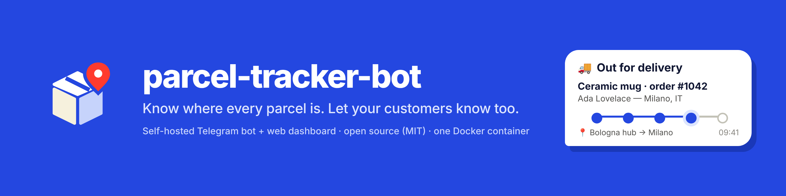
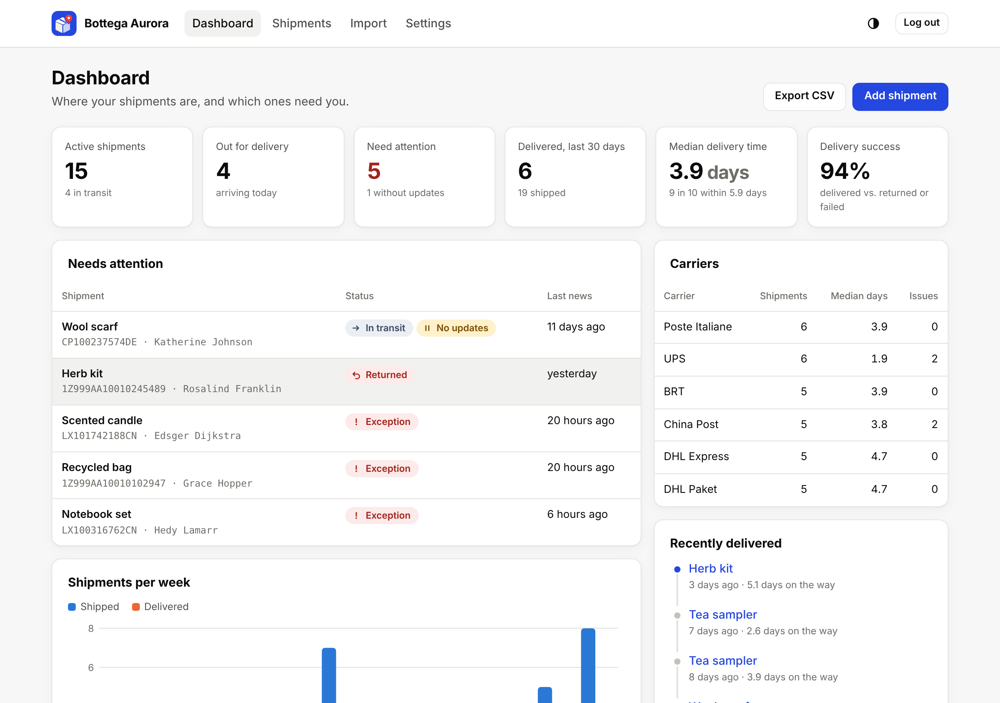
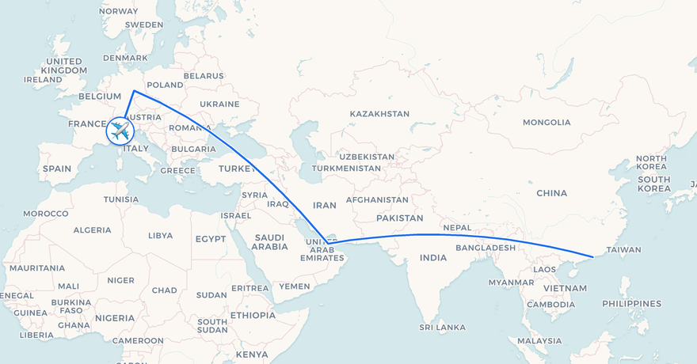
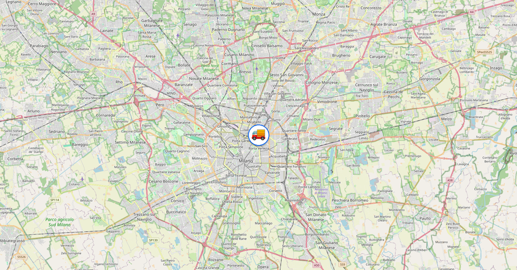
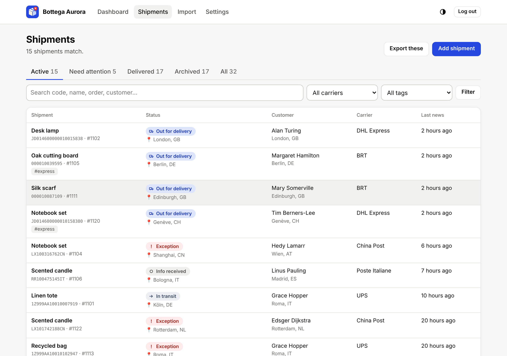
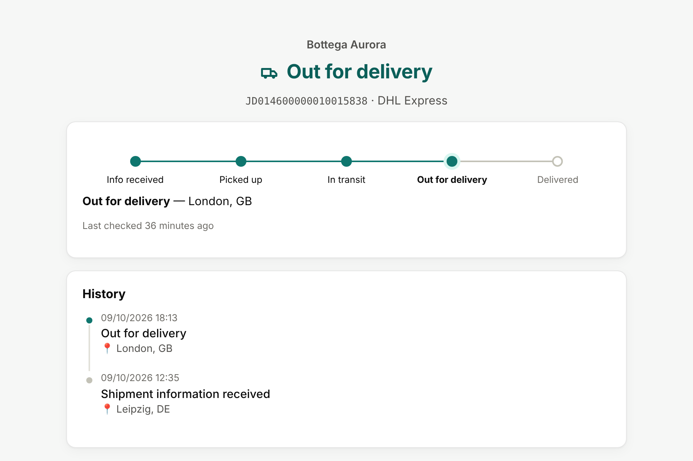

<p align="center">
  
</p>

# parcel-tracker-bot

[](https://github.com/bernalli/parcel-tracker-bot/actions/workflows/ci.yml)
[](https://github.com/bernalli/parcel-tracker-bot/actions/workflows/security.yml)
[](https://codecov.io/gh/bernalli/parcel-tracker-bot)
[](LICENSE)
[](https://www.python.org/downloads/)

A self-hosted parcel tracker for people and small online shops. Send it a
tracking number on Telegram and it follows the parcel with the carrier, tells
you when something changes, and draws the route on a map. Turn on the web
dashboard and it becomes a shipment control room: every parcel you sent, the
ones that need you, and a tracking page for each customer.

- **Any carrier.** The carrier is detected from the code; 17track covers
  2,000+ carriers, with direct sources for DHL and 20 national posts and couriers.
- **Smart alerts.** Status changes with a route map, a warning when a parcel
  stops moving, and failed deliveries that are never mistaken for deliveries.
- **For sellers.** Order numbers, customers, tags and notes; CSV import and
  export; seller mode; delivery-time statistics per carrier.
- **Customer tracking pages** under your shop name, showing carrier data and
  nothing of yours.
- **Web dashboard and JSON API**, signed in from Telegram with no passwords.
- **Private by design.** One Docker container, one SQLite file, no third-party
  analytics, offline geocoding, English and Italian.

<p align="center">
  <picture>
    <source media="(prefers-color-scheme: dark)" srcset="docs/img/dashboard-dark.png">
    
  </picture>
</p>

## Quick start

You need Docker with Compose, a bot token from [@BotFather](https://t.me/BotFather)
and your numeric Telegram user ID.

```bash
git clone https://github.com/bernalli/parcel-tracker-bot.git
cd parcel-tracker-bot
cp .env.example .env
# Edit .env: TELEGRAM_BOT_TOKEN, OWNER_ID and (recommended) TRACK17_API_KEY.
docker compose up -d
```

Send `/start` to your bot, then paste a tracking number. Don't know your ID?
Start the bot anyway and send `/whoami`.

To open the web dashboard, add these to `.env`, run `docker compose up -d`
again, and send `/web` to the bot:

```dotenv
WEB_ENABLED=true
WEB_PUBLIC_URL=http://localhost:8080
```

Tagged releases are also published as `ghcr.io/bernalli/parcel-tracker-bot`.
For a public address, HTTPS and backups, read [operations](docs/operations.md).

## Using the bot

Everything is reachable from `/menu` with buttons. You can also just type:

| You send | The bot |
|---|---|
| A tracking number, also with spaces, after a label or inside a carrier link | Starts tracking it and asks for a name |
| Several codes, one per line, as a list or separated by commas | Adds them all |
| A `.csv` file | Imports the shipments it contains |
| `/list` | Shows your active parcels |
| `/web` | Sends a one-time sign-in link for the dashboard |
| `/export` | Sends all your shipments as CSV |
| `/forgetme` | Deletes everything stored about you |
| `/help` | Lists everything else |

Each parcel card has **Update now**, **Events**, **Map**, **Rename**,
**Details** (order, customer, destination, tags, notes), **Share** (customer
tracking link) and **Remove**. Notifications can be muted per status in
**Settings → Notifications**.

| Intercontinental route | Out for delivery |
|---|---|
|  |  |

Status updates come with a map of the route, rendered by the bot itself from
OpenStreetMap data.

## For online sellers

Turn on **Seller mode** in the settings: delivered parcels are archived
automatically with a short notice, instead of the "did you receive it?"
question meant for buyers. Then:

- add shipments by pasting codes, uploading your shop's CSV export, or from
  your shop through the [JSON API](docs/web.md#json-api);
- check **Need attention** for carrier problems and parcels with no news for a
  week, and get a Telegram warning when one stalls;
- send customers a tracking link with your shop name on it;
- compare carriers by delivery time and success rate.

The full workflow is in the [sellers guide](docs/sellers.md).

<p align="center">
  
</p>

<p align="center">
  
  <br>
  <em>The tracking page your customer sees: your shop name, the carrier's data, nothing else.</em>
</p>

## Tracking sources

| Source | Setup | Covers |
|---|---|---|
| **17track API** (recommended) | `TRACK17_API_KEY` | 2,000+ carriers worldwide, and the fallback for every parcel |
| **DHL official API** | `DHL_API_KEY` | DHL Express, DHL Paket / Deutsche Post, DHL eCommerce |
| **Built-in web scrapers** | none | UPS, USPS, FedEx, Royal Mail, La Poste, Deutsche Post, DPD, GLS, Correos, Correios, Canada Post, Australia Post, PostNL, bpost, Swiss Post, Österreichische Post, Aramex, Evri, Yodel, DHL |
| **Detection only** | via 17track | Amazon Logistics, China Post, EMS, Japan Post, Singapore Post |

The scrapers are best effort: carriers change their sites and some only render
tracking with JavaScript. When a scraper cannot read a parcel, 17track takes
over. International postal codes (`RR…IT`, `CP…DE`, `LX…CN`) are validated
and show their postal operator straight away. Missing a courier? Write a
[plugin](docs/plugins.md) in about 50 lines. Details and patterns are in
[trackers](docs/trackers.md) and [api-keys](docs/api-keys.md).

## Configuration

`.env.example` lists every setting with its default. The essentials:

| Variable | Default | Purpose |
|---|---|---|
| `TELEGRAM_BOT_TOKEN` | required | Bot token from @BotFather |
| `OWNER_ID` | required | Your Telegram ID; always an admin |
| `TRACK17_API_KEY` | empty | Universal tracking source and fallback |
| `MAX_ACTIVE_SHIPMENTS` | `20` | Per user; `0` for no limit |
| `STALL_ALERT_DAYS` | `7` | Warn about parcels with no news; `0` turns it off |
| `WEB_ENABLED` / `WEB_PUBLIC_URL` | `false` / `http://localhost:8080` | Web dashboard and the base of the links the bot sends |
| `DEFAULT_LANGUAGE` | `en` | `en` or `it`; each user can switch |
| `DATA_RETENTION_DAYS` | `180` | Delete archived parcels after N days |

## Privacy and security

- Only tracking numbers leave your server, to the carrier or 17track. Names,
  customers, addresses and notes stay in your SQLite file.
- Geocoding is offline (GeoNames); map tiles are fetched by the server, never
  by a visitor's browser.
- The container runs as a non-root user with a read-only filesystem, no
  capabilities and resource limits.
- The dashboard uses single-use sign-in links, hashed sessions and tokens,
  CSRF protection and a strict Content-Security-Policy.
- `/forgetme` erases a user; archived parcels expire after
  `DATA_RETENTION_DAYS`.

Found a vulnerability? Please report it privately: see [SECURITY](SECURITY.md).

## Documentation

- [Sellers guide](docs/sellers.md) — running a shop's shipments with the bot
- [Web dashboard and JSON API](docs/web.md)
- [Operations](docs/operations.md) — deployment, reverse proxy, backups, upgrades
- [Tracking sources and API keys](docs/api-keys.md) · [Carriers](docs/trackers.md)
- [Writing a plugin](docs/plugins.md)
- [Architecture](docs/architecture.md) · [Observability](docs/observability.md)
- [Translations](docs/i18n.md) · [Troubleshooting](docs/troubleshooting.md)
- [Changelog](CHANGELOG.md)

## Contributing

Bug reports, couriers, translations and documentation fixes are welcome. Read
[CONTRIBUTING](CONTRIBUTING.md) for the development setup, and try the
dashboard on demo data with `python scripts/demo_web.py`. This project follows
the [code of conduct](CODE_OF_CONDUCT.md).

## License

MIT — see [LICENSE](LICENSE). Copyright © 2026 Samuele Martinalli and
contributors. Map data © OpenStreetMap contributors, © CARTO; place names from
GeoNames (CC BY 4.0), see [NOTICE](NOTICE).
